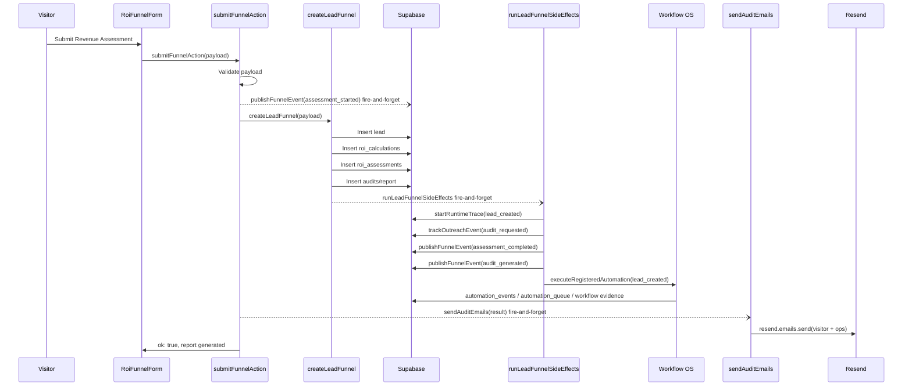

# Landing Page Report Email Audit

Audit date: 2026-06-14  
Scope: Public landing page Revenue Assessment report email workflow  
Verdict: **EMAIL DELIVERY BROKEN**

## Executive Summary

The latest public landing page Revenue Assessment completed report generation successfully, but the email was not delivered because the delivery workflow did not reach Resend.

Primary evidence:

- Lead, ROI calculation, ROI assessment, and audit/report records were created.
- No `outreach_events` were persisted for the completed assessment.
- No `workflow_events`, `workflow_executions`, `automation_events`, `automation_queue`, or workflow execution evidence records exist for the assessment.
- A `lead_created` automation trace exists but is stuck in `running` with no trace events.
- Resend API is configured and reachable, but the account shows no email records.
- Resend has only `lastcardapp.com` configured, status `not_started`; the code sends from `audit@zenith-ai.com` and `ops@zenith-ai.com`, neither of which is configured in Resend.

Final failure classification:

- Exact failure point: post-report side effects / email send path after `createLeadFunnel`.
- Root cause: assessment side effects and email sending are fire-and-forget (`void ...`) and did not complete/persist evidence after the HTTP/server-action response. If the Resend call did execute, it would also be blocked by unverified/mismatched sending domain configuration.
- Severity: High. The visitor sees "Report Generated" while report delivery is not guaranteed and currently has no provider-side delivery record.

## Workflow Trace

Code path:

- Landing page renders `RoiFunnelForm` from `components/public/roi-funnel-form.tsx`.
- Form submit calls `submitFunnelAction(payload)` in `app/actions.ts`.
- `submitFunnelAction` validates with `funnelSubmissionSchema`.
- It fire-and-forgets `publishFunnelEvent({ eventType: "assessment_started" })`.
- It awaits `createLeadFunnel(parsed.data)` in `lib/data/leads.ts`.
- `createLeadFunnel` synchronously creates:
  - `leads`
  - `roi_calculations`
  - `roi_assessments`
  - `audits`
- `createLeadFunnel` then fire-and-forgets `runLeadFunnelSideEffects(...)`.
- `submitFunnelAction` then fire-and-forgets `sendAuditEmails(result)`.
- `sendAuditEmails` uses the Resend SDK directly from `lib/email.ts`.
- `lib/adapters/email-adapter.ts` has a simulated `sendEmail` adapter, but it is not used by this assessment email path.

Sequence diagram:



Observed execution diverges after report persistence: `lead_created` trace was created, but event, automation, and email evidence did not persist.

## Database Evidence

Most recent assessment submission:

- Lead ID: `234700f1-db5f-4d51-aa1e-debaf6c14c47`
- Practice: `Beeline Dental`
- Contact: `DR Goose`
- Recipient: `oadeyemo306@gmail.com`
- Created: `2026-06-14T22:05:25.82667+00:00`
- Organization ID: `null`
- Lead status: `audit_requested`
- Source: `free_revenue_opportunity_assessment`

| Stage / Table | Result | Evidence |
|---|---:|---|
| `leads` | PASS | Lead row exists, ID `234700f1-db5f-4d51-aa1e-debaf6c14c47`, created `2026-06-14T22:05:25.82667+00:00`, status `audit_requested`, org `null`. |
| `roi_calculations` | PASS | Row `5c486337-4119-47e7-bf1b-82ad6107c178`, created `2026-06-14T22:05:26.221952+00:00`. |
| `roi_assessments` | PASS | Row `d2e0f072-0a32-4250-af7b-7eb623a6d010`, created `2026-06-14T22:05:26.364737+00:00`. |
| `audits` | PASS | Report/audit row `ad4bd4b8-b294-4c50-b0df-9e82d0000490`, generated `2026-06-14T22:05:26.711785+00:00`. |
| `outreach_events` | FAIL | No rows for lead ID `234700f1-db5f-4d51-aa1e-debaf6c14c47`. Expected `audit_requested`, `assessment_completed`, and `audit_generated`. |
| `workflow_events` | FAIL | No rows found. |
| `workflow_executions` | FAIL | No rows found. |
| `automation_events` | FAIL | No rows found. |
| `automation_queue` | FAIL | No rows found. |
| `automation_traces` | FAIL | One `lead_created` trace exists but remains `running`; not completed or failed. |
| `automation_executions` | FAIL | No exact `automation_executions` table/code path found; nearest runtime tables have no completed execution for this assessment. |
| `audit_logs` | FAIL | No exact `audit_logs` table found. `workflow_audit_logs` exists but has no related/recent rows. |

Automation trace:

- Trace ID: `cd584bf0-1150-46de-8474-129d77b7524c`
- Workflow ID: `lead_created`
- Event name: `lead_funnel_submission`
- Status: `running`
- Correlation ID: `0dce4fe9-678a-48b7-962a-01b21e839f5c`
- Organization ID: `00000000-0000-4000-8000-000000000000`
- Started: `2026-06-14T22:05:27.057158+00:00`
- Completed: `null`
- Failure reason: `null`
- Trace events: none

## Report Generation

Report generation completed successfully.

Generation code:

- Revenue projection: `calculateRevenueProjection` in `lib/roi.ts`
- Report payload: `buildAliceRevenueOpportunityReport` in `lib/roi.ts`
- Persistence: `createLeadFunnel` in `lib/data/leads.ts`
- Storage:
  - `roi_assessments.alice_report`
  - `audits.alice_report`
  - `audits.audit_summary`
  - `audits.recommendations`
  - `audits.ninety_day_snapshot`

Generated report metadata:

- Assessment ID: `d2e0f072-0a32-4250-af7b-7eb623a6d010`
- Audit/report ID: `ad4bd4b8-b294-4c50-b0df-9e82d0000490`
- Practice Health Score: `57`
- Revenue Recovery Opportunity: `33793.68`
- Recall Opportunity: `4687.20`
- Treatment Opportunity: `11483.64`
- Chair Fill Opportunity: `9374.40`
- Review Opportunity: `1953.00`
- Referral Opportunity: `1562.40`
- Report URL: none stored by this workflow.
- Exceptions: none observed in synchronous report persistence.

Report content exists in both `roi_assessments.alice_report` and `audits.alice_report`.

## Event Publication

Exact event names used by code:

- `assessment_started`
- `audit_requested`
- `assessment_completed`
- `audit_generated`
- `opportunity_created`
- Workflow lifecycle event: `workflow.execution.started`

Expected examples vs actual code:

- `lead.created`: not used. Code uses workflow ID `lead_created`.
- `assessment.completed`: not used. Code uses `assessment_completed`.
- `roi.generated`: not used.
- `report.generated`: not used. Code uses `audit_generated`.

Findings:

- Event created: FAIL for the completed assessment.
- Event persisted: FAIL. No `outreach_events` rows exist for the lead.
- Event consumed: FAIL. No workflow execution or automation queue records exist.

Additional schema issue:

`publishEvent` / `publishFunnelEvent` attempt to write runtime fabric fields such as `channel`, `status: "succeeded"`, `emitted_at`, and `processed_at`. The deployed `runtime_event_fabric_events` table expects `organization_id`, `event_key`, `target_channel`, `status: published|delivered|replayed|failed`, and `published_at`. This mismatch means runtime fabric telemetry cannot persist as currently written.

## Automation Evidence

The assessment attempted to start the `lead_created` workflow side-effect path, but no automation execution completed.

| Field | Value |
|---|---|
| Workflow ID | `lead_created` |
| Trace ID | `cd584bf0-1150-46de-8474-129d77b7524c` |
| Correlation ID | `0dce4fe9-678a-48b7-962a-01b21e839f5c` |
| Status | `running` |
| Started At | `2026-06-14T22:05:27.057158+00:00` |
| Completed At | `null` |
| Error | `null` |
| Workflow execution row | none |
| Automation event row | none |
| Automation queue row | none |
| Workflow evidence row | none |

Determination:

- Did execution run? FAIL. A trace was created, but no workflow execution/automation queue record was created.
- Did execution fail? UNKNOWN from persisted status; it is stuck `running` with no failure reason.
- Did execution succeed? FAIL.

## Email Evidence

Email code path:

```text
RoiFunnelForm
  -> submitFunnelAction
  -> createLeadFunnel
  -> sendAuditEmails(result)
  -> Resend SDK resend.emails.send(...)
```

Template/source:

- File: `lib/email.ts`
- Function: `sendAuditEmails`
- Visitor subject: `Your FREE Revenue Opportunity Assessment for Beeline Dental`
- Visitor from: `Zenith ... <audit@zenith-ai.com>`
- Visitor to: `oadeyemo306@gmail.com`
- Ops subject: `New FREE Revenue Assessment: Beeline Dental`
- Ops from: `Zenith ... <ops@zenith-ai.com>`
- Ops to: `ops@zenith-ai.com`
- Attachment/report link: none. The report is embedded as HTML summary/KPI content.

Was `sendEmail` adapter called?

- FAIL. `lib/adapters/email-adapter.ts::sendEmail` is not used by this workflow.
- The assessment uses direct Resend SDK calls in `lib/email.ts`.

Was `sendAuditEmails` called?

- Intended by code, but not proven by durable evidence.
- It is invoked as `void sendAuditEmails(result).then(...).catch(...)`, so completion is not awaited before returning success to the visitor.
- No email event, provider message ID, or delivery result is persisted.

## Resend Evidence

Configuration:

- `RESEND_API_KEY`: present in `.env.local`
- Loaded mode: live Resend SDK mode in `lib/email.ts`
- Simulation mode: not used by the assessment email path.
- Fallback mode: none.
- Development/preview/production: local environment file was audited. Vercel project metadata exists, but production env values were not pulled during this audit.

Provider query:

- Resend API reachable.
- `GET /domains`: `200`
- `GET /emails`: `200`
- Email list: empty (`data: []`)

Delivery result:

- Did Resend accept the request? FAIL / no evidence. Resend email list is empty.
- Did Resend reject the request? No rejection record available because no provider email record exists.
- Provider message ID: none.
- Provider response: no email send response persisted by application; provider list returned no emails.
- Error response: none persisted.

## Domain Configuration

Resend domains:

| Domain | Status | Sending | Receiving |
|---|---|---:|---:|
| `lastcardapp.com` | `not_started` | enabled | disabled |

DNS record statuses for `lastcardapp.com`:

- DKIM: `not_started`
- SPF MX: `not_started`
- SPF TXT: `not_started`
- DMARC: not returned by Resend domain details.

Sending domain used by code:

- `audit@zenith-ai.com`
- `ops@zenith-ai.com`

Findings:

- `zenith-ai.com` is not configured in Resend.
- The only configured domain is unrelated to the sender domain and is not verified.
- This is a deliverability/configuration blocker if the email call reaches Resend.

## Root Cause

1. Exact failure point  
   After synchronous report generation, in the non-awaited side-effect/email layer. The report rows were created, but event publication, automation execution, and email delivery did not complete with durable evidence.

2. Root cause  
   The assessment returns success while critical side effects are fire-and-forget:
   - `void runLeadFunnelSideEffects(...)`
   - `void sendAuditEmails(result)...`
   In the observed run, only the first automation trace was persisted, then the downstream side-effect chain did not persist events, automation records, or email provider evidence.

3. Secondary blocker  
   Resend sending domain configuration is invalid for the sender used by code. `zenith-ai.com` is not configured, while `lastcardapp.com` is unverified/not started.

4. Severity  
   High. Visitor-facing report generation appears successful, but email delivery is not reliable and currently has no successful provider record.

5. Required fix  
   Do not add new features or architecture during this audit. Required remediation is to make the existing email/report delivery path durable and observable:
   - Await or otherwise durably queue the existing report email side effect before claiming delivery.
   - Persist provider response/error, message ID, recipient, subject, and correlation ID.
   - Align runtime event fabric writes to the deployed schema.
   - Configure and verify the actual sender domain used by the code, or change sender to a verified domain.

6. Estimated remediation effort  
   0.5-1 day for code-path hardening and evidence persistence, plus DNS verification time for Resend domain setup.

## Stage Verdicts

| Stage | Verdict |
|---|---|
| Landing page submission | PASS |
| Lead creation | PASS |
| ROI calculation creation | PASS |
| ROI assessment creation | PASS |
| Report generation | PASS |
| Report storage | PASS |
| Event publication | FAIL |
| Event persistence | FAIL |
| Event consumption | FAIL |
| Automation execution | FAIL |
| Email adapter call | FAIL |
| Resend API key loaded | PASS |
| Resend request accepted | FAIL / no evidence |
| Resend message ID captured | FAIL |
| Delivery result captured | FAIL |
| Sending domain configured | FAIL |
| Sending domain verified | FAIL |
| SPF/DKIM verified | FAIL |
| DMARC verified | FAIL / not present in provider response |

## Final Verdict

**EMAIL DELIVERY BROKEN**

The assessment report was generated and stored, but the workflow failed before durable email delivery. There is no persisted email event, no workflow execution, no automation queue record, no provider message ID, and no Resend email record for the submission. The Resend account also lacks a verified sender domain matching the code's `zenith-ai.com` sender addresses.
